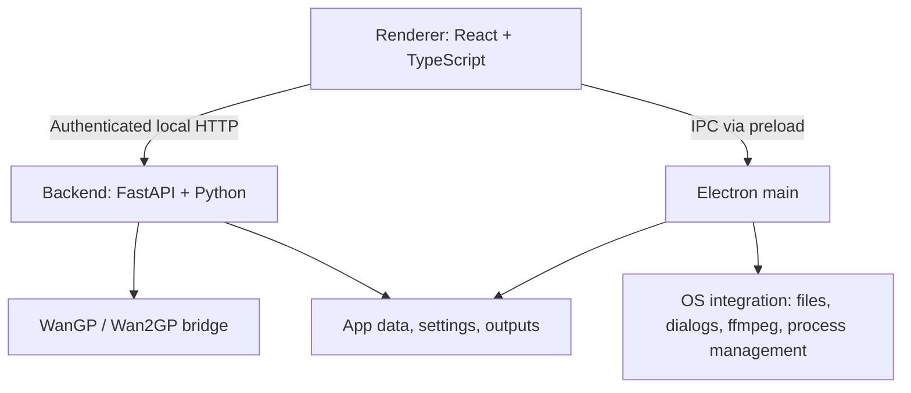

<p align="center"></p>
<p align="center">AI Video Studio</p>
<p align="center">A local-only desktop app for AI image and video generation<br>powered by WanGP.</p>

<p align="center"></p>

This WIP project is a fork `deepbeepmeep/LTX-Desktop-WanGP`.

Note: I'm more of a Solutions Architect than a coder, so I'm up-front clarifying that this is heavily coded by AI. But I have a vision of what this should be (essentially the ease-of-use of online AI Platforms, Magnific/Higgsfield etc, with the beauty of OSS and local-only AI Gen, and the power of WanGP behind it!) I can't guarantee it'll work great for everyone, so far I've only tested this on one of my systems (128gb ram - RTX 4070Ti Super) and its working great there, will try to test on other systems in due course.

# Product Principles

- **Local-Only:** Powered by WanGP, no cloud/third-party/off-site generations.
- **Curated models:** AiVS exposes tested - fast - model profiles, not every raw WanGP model or setting.
- **Simple first:** GenSpace should show useful creative controls, not raw technical configuration.

# Current Status

AiVS is in active development. Director Mode V1 is available as a standalone workspace for planning and generating prompt-driven video timelines. Guide Audio and Control Media tracks are visible but remain locked for a later release.

# New Features:

- Deeper integration with WanGP, removing all cloud/third-party/non-local elements.
- Streamlined app launch & added connection indicator & refresh button for connection to WanGP backend.
- Settings:
	- Added video/image output settings (Settings > Outputs)
	- Added Model Manager: optional WanGP model packs, approximate sizes, status, download and cancel controls.
	- Removed most other settings, but kept 'Torch-Compile' option and ensured it's hooked into WanGP. <p align="center"></p>
- First run:
	- Bundled Python, pip and uv automatically install the compatible WanGP GPU runtime.
	- Optional model-pack selection has live transfer status and can be skipped for automatic download on first use.
	- Project storage is selected at the end of setup; default: `Documents\\AiVS`.
- Gallery:
	- Added ability to drag and drop your own items into gallery (for easier access to regular references etc)
	- Added Filtering (Type: Image/Video/Audio. Source: Generated/Uploaded)
	- Added 'Bin' (folder) support so you can easily organise your assets
	- Added 'List' view as an alternative to the grid views. <p align="center"></p>
  - Added a 'cancel' button and better indications of generation progress in asset cards.<p align="center"></p>
- GenSpace:
	- Prompting:
		- Added seed lock button to prompt box
		- added enhance prompt button to prompt box
		- moved media inputs above text prompt area and made it collapsible for tidier working. <p align="center"></p>
	- Image Gen:
		- Added Additional Image Models: Flux2 Klein 4b, Krea2 Turbo & HiDream O1, plus the existing z-image-turbo.
		- Added support for input images for supporting models, including a dropdown menu to select reference type (Transfer Human Pose, Transfer Depth, Transfer Canny Edges etc):
			- Z-Image-Turbo: Technically doesn't support inputs, but I've routed it so if you add one it'll use Z-Image-Turbo Fun ControlNet 6B v2.1 instead which can accept a controlnet image.
			- Flux2 Klein 4b natively allows reference images, I've allows up to 5, which I think is a sane amount (not sure how many it can take).
			- Krea2 Turbo currently doesn't support input images
			- HiDream O1 natively allows reference images, I've allows up to 5, which I think is a sane amount (not sure how many it can take). <p align="center"></p>
	- Video Gen:
		- Added Start/End frame support
		- Added Control Video/Audio support with video trim capabilities (note when a control video is added, the 'duration' setting turns to 'auto' and is controlled by the trim length).
		- Retake is visible as **Retake (soon)** but disabled until WanGP supports it reliably.
		- Added new reframe mode with a nice easy to use framing UI that takes a control video and then uses ltx outpaint lora to expand edges. <p align="center"></p>
- Director Mode:
	- Added a standalone workspace between GenSpace and Video Editor with the shared asset library, multiple Director timelines, contextual segment settings, preview playback and a frame-based timeline.
	- Build videos from movable and resizable prompt segments, optional local/global prompts, key frames pinned to Start/Middle/End, or a frame-zero Continue Video segment. Gaps, segment reordering, ripple resizing and contextual split/delete are supported.
	- Generated videos populate a Generated track automatically. Regenerations become takes, with timeline playback, scrubbing, looping, take selection, visibility and deletion controls.
	- Director V1 runs at 24 fps, snaps output lengths to `8n+1`, and supports timelines up to 20 seconds. Guide Audio and Control Media tracks are reserved for later releases.
	- See [Director Mode V1](docs/DIRECTOR_MODE_V1.md) and the [implementation plan](docs/DIRECTOR_MODE_V1_IMPLEMENTATION_PLAN.md) for current behavior and constraints.

# Planned

- Retake mode when WanGP support is ready
- LoRA UI
- Audio/TTS Gen
- Production workflow

## Windows Release System Requirements

- Windows 10 or 11, 64-bit.
- NVIDIA RTX 20, 30, 40 or 50 series GPU. GTX cards are not supported.
- NVIDIA driver 580 or newer. AiVS uses one supported runtime: Torch 2.10 with CUDA 13.0.
- VRAM: 12 GB minimum for selective/light use, 16 GB recommended for image work, 24 GB recommended for LTX video and larger model packs. This is guidance, not an enforced hardware gate.
- At least 50 GB free disk space where model packs are installed; more is needed for several packs and generated media.

The desktop installer includes the independent Wan2GP source, Python, pip, uv and GPU runtime setup. First run copies the bundled Wan2GP source into a writable user-data folder identified by source content; it does not clone or update Wan2GP from the network. It does not require Node.js, pnpm or a system Git installation.

## Quick Start: Windows

Prerequisites:

- Windows 10/11
- NVIDIA GPU with CUDA support
- Node.js
- pnpm
- Git
- PowerShell

Recommended setup:

```powershell
pnpm setup:dev:win
pnpm dev
```

`setup:dev:win` validates and uses `C:\Wan2GP` directly. It prepares the backend environment without cloning, switching, or patching Wan2GP source. Development and the browser launcher use that same folder; Git history is not required.

To use a Wan2GP checkout at another location:

```powershell
$env:WANGP_ROOT = "D:\Wan2GP"
pnpm setup:dev:win
pnpm dev
```

`WANGP_WGP_PATH` is accepted for compatibility when `WANGP_ROOT` is not set. The external checkout must contain `wgp.py`, `shared/api.py`, and `requirements.txt`.

Release builds bundle the runtime code and native definitions from this folder, excluding local finetunes, model weights, outputs and caches. AiVS uses native Wan2GP model definitions and does not add custom checkpoint definitions.

## Quick Start: Linux

Linux support currently targets source/dev usage with WanGP.

Prerequisites:

- Node.js
- pnpm
- uv
- Git
- ffmpeg
- NVIDIA GPU with CUDA support
- external WanGP checkout configured through `WANGP_ROOT` (or `WANGP_WGP_PATH`)

```bash
export WANGP_ROOT=/path/to/Wan2GP
pnpm setup:dev:linux
pnpm dev
```

The Linux setup script validates the external checkout and never clones or changes it.

## Runtime Notes

The backend uses Python 3.11.9, pinned by `.python-version`.

The Windows WanGP stack installer is:

```powershell
scripts/install-wangp-stack.ps1
```

Useful options:

```powershell
scripts/install-wangp-stack.ps1 -List
scripts/install-wangp-stack.ps1 -SkipWan2gpRequirements
```

The installer validates supported RTX generation and NVIDIA driver 580+, then installs pinned Torch 2.10/CUDA 13 plus curated performance wheels into `backend/.venv`.

Development setup and backend test commands use `uv sync --inexact` so normal dependency syncs update declared backend packages without pruning WanGP requirements or performance wheels installed into the same virtual environment.

## Development

Install dependencies:

```bash
pnpm install --frozen-lockfile
```

Run the app:

```bash
pnpm dev
```

Run with debugging:

```bash
pnpm dev:debug
```

Typecheck:

```bash
pnpm typecheck
```

Backend tests:

```bash
pnpm backend:test
```

Frontend build:

```bash
pnpm build:frontend
```

Frontend validation:

```bash
pnpm validate:frontend
```

If pnpm tries to recreate `node_modules` in a non-interactive terminal, set CI mode:

```powershell
$env:CI = "true"
pnpm typecheck:ts
```

This repo pins `pnpm@10.30.3` through `package.json`. Use Corepack or the same pnpm version consistently to avoid `node_modules` reinstall prompts caused by package-manager metadata mismatches.

## Architecture

AiVS has three main layers:



### Frontend

- Path: `frontend/`
- React 19, TypeScript 6, Vite 8, Tailwind CSS 4
- Quick Gen composition: `frontend/views/genspace/GenSpaceWorkspace.tsx`
- Draft state and orchestration: `frontend/views/genspace/hooks/useGenSpaceController.tsx`
- Queue lifecycle and project-scoped result persistence: `frontend/contexts/GenerationQueueContext.tsx`
- Draft submission: `frontend/hooks/use-generation.ts`
- Model profile hook: `frontend/hooks/use-image-profiles.ts`
- Model profile types: `frontend/types/model-profiles.ts`

### Electron

- Path: `electron/`
- Owns app lifecycle, native dialogs, file access, export, and Python backend process supervision
- Renderer communicates through the preload bridge exposed as `window.electronAPI`

### Backend

- Path: `backend/`
- Local FastAPI server; the renderer uses the Electron-provided URL and session token through `backendFetch()`
- Thin routes call handlers; handlers call services and mutate centralized state
- WanGP bridge: `backend/services/wangp_bridge.py`
- Model profiles: `backend/model_profiles/profiles.py`
- Resolution resolver: `backend/model_profiles/resolution_resolver.py`
- Profile API handler: `backend/handlers/model_profiles_handler.py`

## Key Commands

| Command                           | Purpose                                          |
| --------------------------------- | ------------------------------------------------ |
| `pnpm dev`                        | Start Vite, Electron, and backend                |
| `pnpm dev:debug`                  | Start with Electron inspector and Python debugpy |
| `pnpm typecheck`                  | Run TypeScript and Python type checks            |
| `pnpm typecheck:ts`               | TypeScript only                                  |
| `pnpm typecheck:py`               | Pyright only                                     |
| `pnpm test:frontend`              | Full frontend Vitest suite                       |
| `pnpm validate:frontend`          | TypeScript, frontend tests, and frontend build   |
| `pnpm backend:test`               | Backend pytest suite                             |
| `pnpm build:frontend`             | Build renderer and Electron bundles              |
| `pnpm setup:dev:win`              | Windows development setup                        |
| `pnpm setup:dev:linux`            | Linux development setup                          |
| `pnpm wangp:check`               | Inspect source location and required files without modifying it |
| `pnpm wangp:validate`            | Source check and focused source/root tests; no GPU inference |
| `pnpm wangp:validate:full`        | The same checks plus TypeScript/Python checks and frontend/Electron bundling |
| `scripts/install-wangp-stack.ps1` | Install/refresh WanGP GPU stack                  |

## Data Locations

App data uses the AiVS folder name.

- Windows: `%LOCALAPPDATA%\AiVS\`
- Linux: `$XDG_DATA_HOME/AiVS/` or `~/.local/share/AiVS/`
- macOS: `~/Library/Application Support/AiVS/`

Generated outputs are stored under the app data output directory and copied into project asset folders when saved to projects.

## Documentation

- `AGENTS_PRD.md` - product direction and guardrails
- `AGENTS.md` - coding-agent conventions
- `docs/PHASE0_AUDIT.md` - fork audit and preservation map
- `docs/PHASE4_DETAILS.md` - curated model profile brief
- `backend/architecture.md` - backend architecture
- `backend/WANGP_BACKEND.md` - WanGP bridge configuration
- `scripts/wangp-stacks.json` - curated GPU stack config

## Contributing

AiVS is changing quickly. Keep changes small, preserve inherited systems where possible, and route normal generation through WanGP only.

Before adding a model, add or update a curated profile in the backend profile registry. Do not expose arbitrary WanGP models directly in the UI.

## License

Apache-2.0. See `LICENSE.txt`.

The bundled WanGP source and dependencies retain their own licences; see
`THIRD_PARTY_NOTICES.md`. Model weights have separate terms. Source checks, contract
tests and a successful bundle do not establish successful GPU generation.
